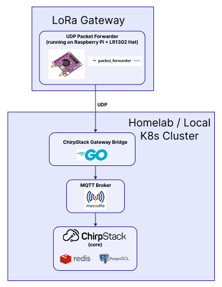

# Helm for ChirpStack LoRaWAN Gateway

[ChirpStack](https://www.chirpstack.io/docs/index.html) is an open-source LoRaWAN Network Server which can be used to setup private or public LoRaWAN networks.  
This repo is meant to simplify the chirpstack setup on my homelab by providing a simple helm chart to be deployed on my kubernetes cluster.  

## Architecture

A generic Chirpstack architecture looks like this:   


**Supported Architecture**  
This helm chart does not support all possible configurations of chirpstack. The supported architecture of this helm chart is shown below. (*Note that the boxes don't necessarily represent k8s pods*)   



## Migrating from TTN
Pointing your LR1302 gateway at this instead of TTN. This assumes you're using the UDP Packet Forwarder based on the instructions outlined in the [Electrow Docs](https://www.elecrow.com/wiki/lr1302-lorawan-gateway-module.html#step-4-configure-ttn-related-content)  

On the gateway, find `global_conf.json` or `local_conf.json` for
`packet_forwarder` and update the `gateway_conf` section:

```json
"gateway_conf": {
  "server_address": "<IP of a k8s node>",
  "serv_port_up": 1700,
  "serv_port_down": 1700
}
```

By default (`gatewayBridge.hostNetwork: true`), the Gateway Bridge binds
directly to port 1700 on whichever node its pod lands on — so
`server_address`

## Before you install

1. **Region config.** `files/region_us915_1.toml` (US915 sub-band/FSB2,
   fetched from the ChirpStack repo) is included and set as the default in
   `values.yaml` (`chirpstack.region: us915_1`) since that's TTN's default
   US frequency plan. **This must match the 8-channel sub-band already
   programmed into your LR1302's channel plan** — check its
   `global_conf.json`/`local_conf.json` channel frequencies if you're not
   sure it's FSB2. If it's a different sub-band, grab the matching
   `region_us915_N.toml` from:
   https://github.com/chirpstack/chirpstack/tree/master/chirpstack/configuration
   drop it in `files/`, remove `region_us915_1.toml`, and update
   `chirpstack.region` to match.


2. **Sealed Secrets** (optional - requires sealed secrets to be installed on your cluster)   
Create the sealed secret -   
Test a secret  
```bash
# Seal the secret
kubeseal --format yaml < extras/plain_secret.yaml > chart/templates/chirp-secrets.yaml --controller-name=sealed-secrets --controller-namespace=sealed-secrets
kubeseal --format yaml < extras/basic_station_secrets.yaml > chart/templates/chirp-basic-station-secrets.yaml --controller-name=sealed-secrets --controller-namespace=sealed-secrets

# Apply the sealed secret
kubectl apply -f example-sealed-secret.yaml

# Verify the secret was created
kubectl get secret my-secret -n default
```